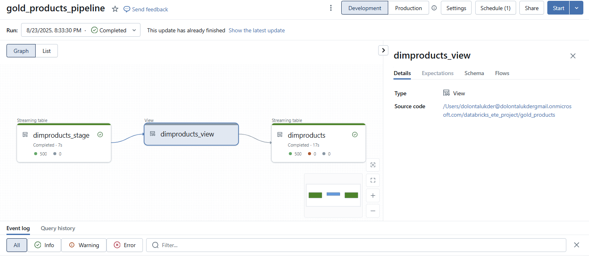

# Azure Databricks End-to-End Pipeline (Medallion: Bronze → Silver → Gold)

[](LICENSE)


Production-like **Azure Databricks (Unity Catalog)** project using **Autoloader**, **Delta Live Tables (DLT)**, and **PySpark** to build a **Gold star schema** (Dimensions + Fact). Designed to show end-to-end engineering, not just a single notebook.

---

## Table of Contents
- [Architecture](#architecture)
- [Project Layout](#project-layout)
- [Data Model (Star Schema)](#data-model-star-schema)
- [How to Run](#how-to-run)
- [Configuration](#configuration)
- [Validation & Quality Checks](#validation--quality-checks)
- [Screenshots](#screenshots)
- [Pain Points & Lessons](#pain-points--lessons)
- [Cost & Cluster Notes](#cost--cluster-notes)
- [License](#license)

---

## Architecture
```mermaid
flowchart LR
  Source[ADLS Gen2 Raw Files] -->|Autoloader| Bronze[Bronze Delta Tables]
  Bronze --> Silver[Silver Curated (conformed)]
  Silver --> GoldDims[Gold Dimensions]
  Silver --> GoldFact[Gold Fact_Orders]
  subgraph DLT
    Silver -->|SCD2/expectations| GoldDims
  end

## Architecture
```mermaid
flowchart LR
  Source[ADLS Gen2 Raw Files] -->|Autoloader| Bronze[Bronze Delta Tables]
  Bronze --> Silver[Silver Curated (conformed)]
  Silver --> GoldDims[Gold Dimensions]
  Silver --> GoldFact[Gold Fact_Orders]
  subgraph DLT
    Silver -->|SCD2/expectations| GoldDims
  end

---

## Project Layout
├─ config/
│  └─ 00_config.py
├─ bronze/
│  └─ 10_bronze_autoload.py
├─ silver/
│  ├─ 20_silver_orders.py
│  ├─ 21_silver_customers.py
│  ├─ 22_silver_products.py
│  └─ 23_silver_regions.py
├─ gold/
│  ├─ 30_gold_dim_customers.py
│  ├─ 31_gold_dim_products_dlt.py   # DLT pipeline (run via Pipelines UI/Jobs, not cell-by-cell)
│  └─ 32_gold_fact_orders.py
└─ docs/
   ├─ pain_points.md
   ├─ lessons_learned.md

---

## Data Model (Star Schema)

erDiagram
  DIMCUSTOMERS {
    INT    DimCustomerKey PK
    STRING CustomerID
    STRING FirstName
    STRING LastName
    STRING Email
    DATE   EffectiveDate
    DATE   EndDate
    STRING RecordStatus
  }

  DIMPRODUCTS {
    INT    DimProductKey PK
    STRING ProductID
    STRING Name
    STRING Category
    DECIMAL Price
    DATE   EffectiveDate
    DATE   EndDate
    STRING RecordStatus
  }

  FACTORDERS {
    STRING OrderID PK
    INT    DimCustomerKey FK
    INT    DimProductKey  FK
    DATE   OrderDate
    INT    Quantity
    DECIMAL UnitPrice
    DECIMAL ExtendedAmount
  }

  DIMCUSTOMERS ||--o{ FACTORDERS : has
  DIMPRODUCTS  ||--o{ FACTORDERS : has

---

## How to Run
### 1. Configure

#### A. config/00_config.py:
CATALOG = "your_catalog"
SCHEMA  = "your_schema"
RAW_PATH     = "abfss://<container>@<account>.dfs.core.windows.net/raw"
BRONZE_PATH  = "abfss://<container>@<account>.dfs.core.windows.net/bronze"
SILVER_PATH  = "abfss://<container>@<account>.dfs.core.windows.net/silver"
GOLD_PATH    = "abfss://<container>@<account>.dfs.core.windows.net/gold"


#### B. Initialize UC objects if needed:
CREATE CATALOG IF NOT EXISTS your_catalog;
CREATE SCHEMA  IF NOT EXISTS your_catalog.your_schema;

### 2. Bronze (Autoloader)
#### Run bronze/10_bronze_autoload.py.
#### Uses spark.readStream.format("cloudFiles") with cloudFiles.schemaLocation.
#### Batch-style run: .trigger(once=True) → ingest then stop.

### 3. Silver transforms
#### Run silver/20–23_* in order (types, keys, business rules).

### 4. Gold
#### Run gold/30_gold_dim_customers.py.
#### Create a DLT Pipeline for gold/31_gold_dim_products_dlt.py (don’t run cell-by-cell).

### 5. Validate (see below).

---

## Configuration

| Setting             | Where                 | Notes                                                  |
| ------------------- | --------------------- | ------------------------------------------------------ |
| `CATALOG`, `SCHEMA` | `config/00_config.py` | Use UC names everywhere: `catalog.schema.table`        |
| Storage paths       | `config/00_config.py` | ABFSS URIs for raw/bronze/silver/gold                  |
| Cluster             | Databricks UI         | Tiny **job** cluster (1–2 workers), **Photon ON**      |
| DLT                 | Pipelines UI          | Configure & run Pipeline; don’t “Run All” the notebook |

---

## Validation & Quality Checks

### Counts (sanity):
SELECT COUNT(*) FROM your_catalog.your_schema.dimcustomers;
SELECT COUNT(*) FROM your_catalog.your_schema.dimproducts;
SELECT COUNT(*) FROM your_catalog.your_schema.factorders;

### Foreign keys should not be NULL in fact:
SELECT SUM(CASE WHEN DimCustomerKey IS NULL THEN 1 ELSE 0 END) AS NullCustomerFK,
       SUM(CASE WHEN DimProductKey  IS NULL THEN 1 ELSE 0 END) AS NullProductFK
FROM your_catalog.your_schema.factorders;

---

## Screenshots

(Will update soon)




---

## Pain Points & Lessons
#### See docs/pain_points.md (UC vs HMS, quotas, DLT vs notebooks, Autoloader gotchas).
#### See docs/lessons_learned.md (the distilled checklist I now follow).

---

## Cost and Cluster Notes

#### For tutorial/dev scale, a small job cluster (1–2 workers) is plenty.
#### Photon ON for SQL/Delta workloads.
#### Cost ≈ cluster uptime. Stop clusters when idle.
#### Check Azure vCPU quotas first to avoid “WAITING_FOR_RESOURCES”.

---

## License
#### Released under the MIT License
