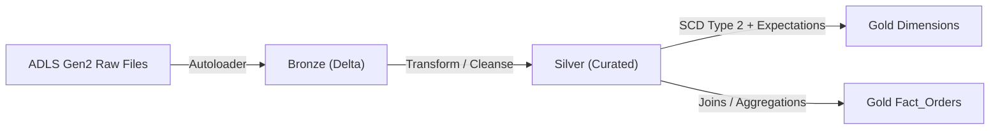
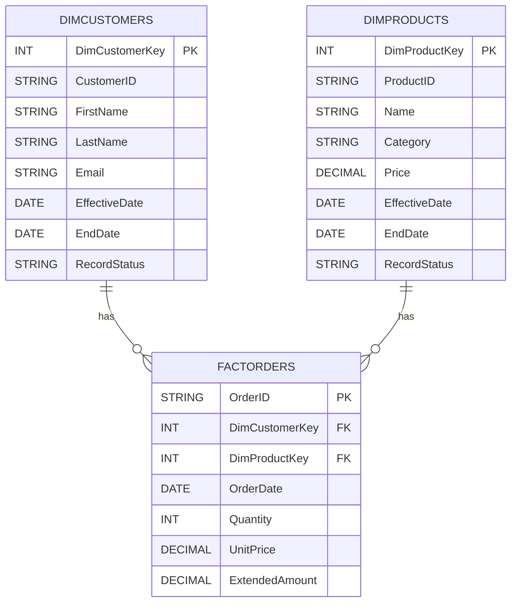
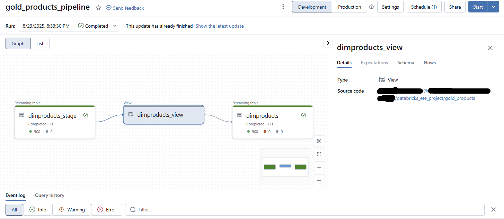
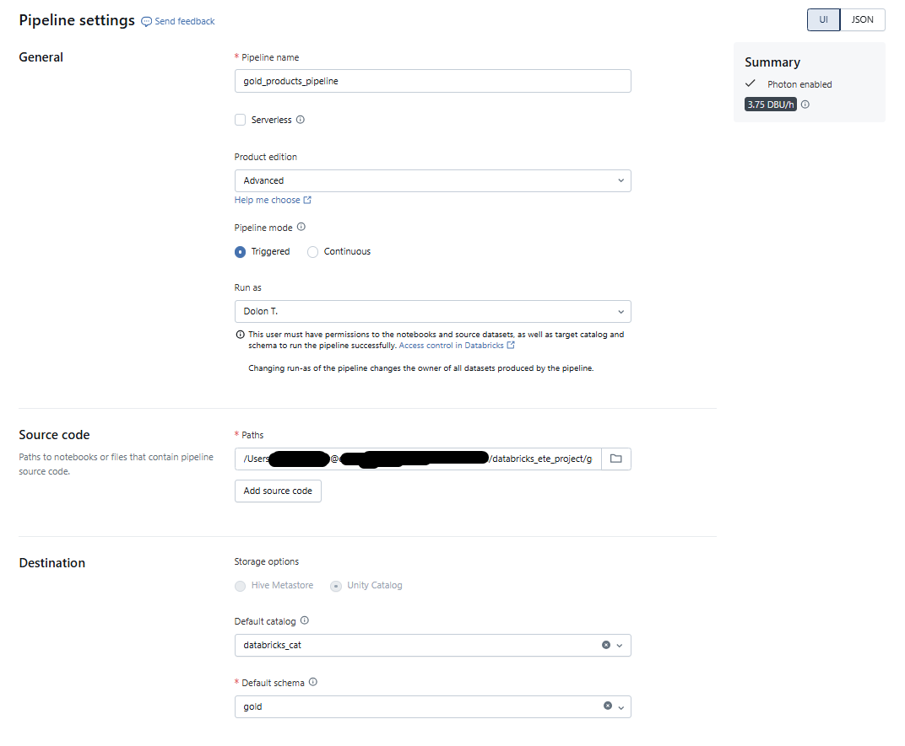
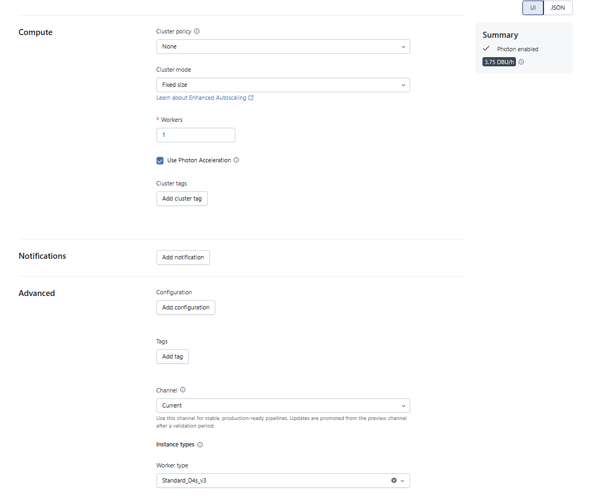
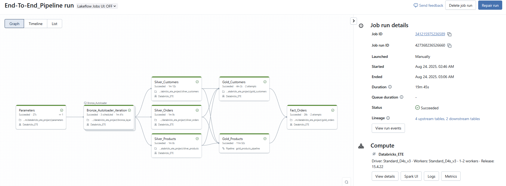
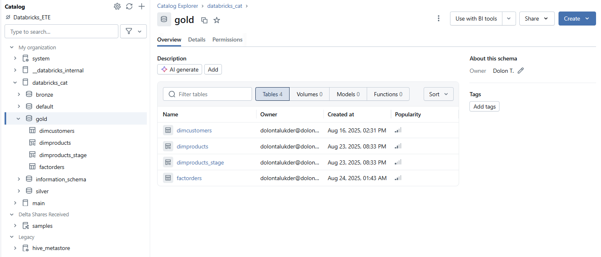
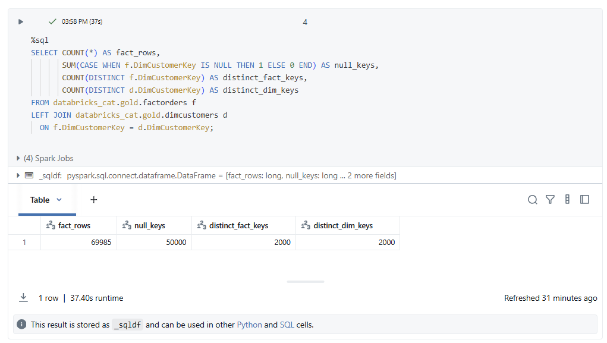

# Azure Databricks End-to-End Pipeline (Medallion: Bronze → Silver → Gold)

[](LICENSE)


Production-like **Azure Databricks (Unity Catalog)** project using **Autoloader**, **Delta Live Tables (DLT)**, and **PySpark** to build a **Gold star schema** (Dimensions + Fact). Designed to show end-to-end engineering, not just a single notebook.
---

**Business Problem it Solves:**

Many organizations face a bottleneck turning raw data into clean, analytics-ready formats that drive decision-making. This project builds a full end-to-end pipeline on Azure Databricks using **Delta Lake** and the **Medallion Architecture (Bronze → Silver → Gold)**. It ingests raw Parquet data, enforces schema, applies cleaning and transformation logic in PySpark, and outputs a **Star Schema** (fact + dimension tables). The pipeline also incorporates data lineage, modular transformations, and validation logic—mirroring how modern enterprises prepare data for dashboards, KPIs, and advanced analytics tools.

---

## Table of Contents
- [Architecture](#architecture)
- [Project Layout](#project-layout)
- [Data Model (Star Schema)](#data-model-star-schema)
- [How to Run](#how-to-run)
- [Configuration](#configuration)
- [Validation & Quality Checks](#validation--quality-checks)
- [Screenshots](#screenshots)
- [Pain Points & Lessons](#pain-points--lessons)
- [Cost & Cluster Notes](#cost--cluster-notes)
- [License](#license)

---

## Architecture



---

## Project Layout

```
├─ bronze/
│ └─ 10_bronze_autoload.py
├─ silver/
│ ├─ 20_silver_orders.py
│ ├─ 21_silver_customers.py
│ ├─ 22_silver_products.py
│ └─ 23_silver_regions.py
├─ gold/
│ ├─ 30_gold_dim_customers.py
│ ├─ 31_gold_dim_products_dlt.py # DLT pipeline (run via Pipelines UI/Jobs, not cell-by-cell)
│ └─ 32_gold_fact_orders.py
└─ docs/
   ├─ pain_points.md
   └─ lessons_learned.md
```

---

## Data Model (Star Schema)



---

## How to Run

### 1. Configure

#### A. Initialize UC objects if needed:
```sql
CREATE CATALOG IF NOT EXISTS your_catalog;
CREATE SCHEMA  IF NOT EXISTS your_catalog.your_schema;
```

#### B. Define storage paths directly in notebooks:
```python
abfss://source@<storageaccount>.dfs.core.windows.net/
abfss://bronze@<storageaccount>.dfs.core.windows.net/
abfss://silver@<storageaccount>.dfs.core.windows.net/
abfss://gold@<storageaccount>.dfs.core.windows.net/
```


### 2. Bronze (Autoloader)
- Run `bronze/10_bronze_autoload.py`  
- Uses `spark.readStream.format("cloudFiles")` with `cloudFiles.schemaLocation`  
- Batch-style run: `.trigger(once=True)` → ingest then stop

### 3. Silver transforms  
- Run `silver/20–23_*` in order (types, keys, business rules)

### 4. Gold  
- Run `gold/30_gold_dim_customers.py`  
- Create a **DLT Pipeline** for `gold/31_gold_dim_products_dlt.py` (don’t run cell-by-cell)

### 5. Validate (see below)

---

## Configuration

| Setting             | Where          | Notes                                                  |
| ------------------- | -------------- | ------------------------------------------------------ |
| `CATALOG`, `SCHEMA` | In notebooks   | Use UC names everywhere: `catalog.schema.table`        |
| Storage paths       | In notebooks   | ABFSS URIs for raw/bronze/silver/gold (see below)      |
| Cluster             | Databricks UI  | Tiny **job** cluster (1–2 workers), **Photon ON**      |
| DLT                 | Pipelines UI   | Configure & run Pipeline; don’t “Run All” the notebook |

---

## Validation & Quality Checks

**Counts (sanity)**  
```sql
SELECT COUNT(*) FROM your_catalog.your_schema.dimcustomers;
SELECT COUNT(*) FROM your_catalog.your_schema.dimproducts;
SELECT COUNT(*) FROM your_catalog.your_schema.factorders;
```

**Foreign keys should not be NULL in fact:**  
```sql
SELECT SUM(CASE WHEN DimCustomerKey IS NULL THEN 1 ELSE 0 END) AS NullCustomerFK,
       SUM(CASE WHEN DimProductKey  IS NULL THEN 1 ELSE 0 END) AS NullProductFK
FROM your_catalog.your_schema.factorders;
```

---

## Screenshots

**DLT pipeline**  


**DLT compute (Photon ON)**  


**DLT compute (details)**  


**Job run DAG (success)**  


**Unity Catalog (catalog & schemas)**  


**SQL sanity (counts & FK nulls)**  


---

## Pain Points & Lessons
- See [docs/pain_points.md](docs/pain_points.md)
- See [docs/lessons_learned.md](docs/lessons_learned.md)


---

## Cost & Cluster Notes

- For tutorial/dev scale, a small job cluster (1–2 workers) is plenty  
- Photon ON for SQL/Delta workloads  
- Cost ≈ cluster uptime. Stop clusters when idle  
- Check Azure vCPU quotas first to avoid “WAITING_FOR_RESOURCES”

---

## License  
- Released under the MIT License
